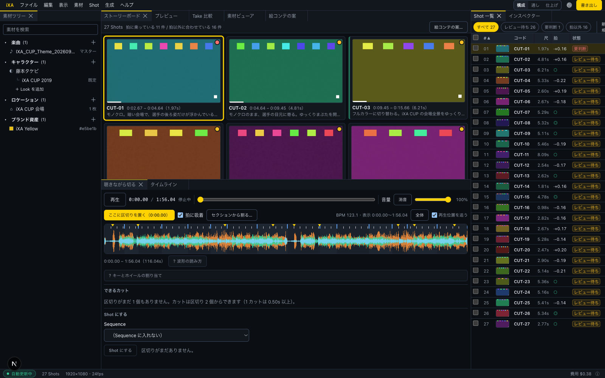
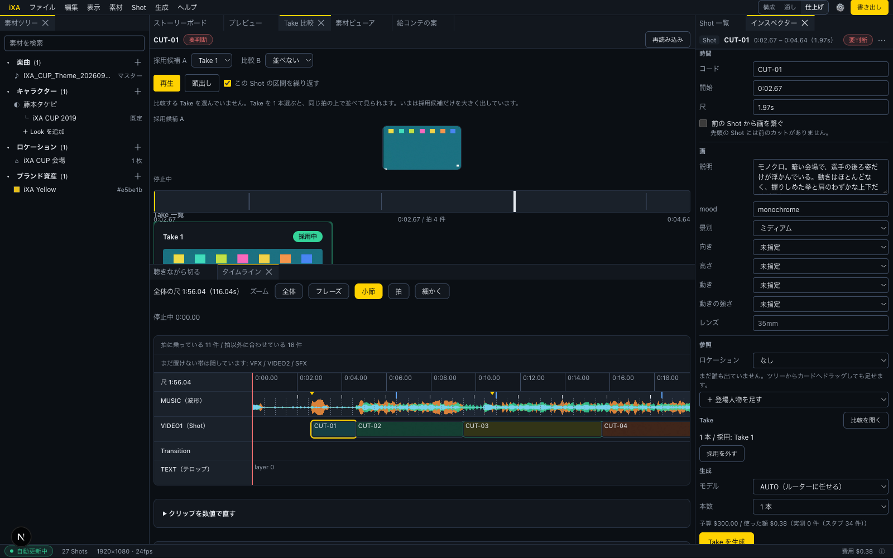

# iXA Video Creator

**AI ネイティブのミュージックビデオ制作ワークベンチ。曲に合わせて切り、Shot ごとに生成し、プレビューしたものがそのまま書き出される。**

[English README](./README.md) · MIT · TypeScript モノレポ



---

多くの AI 映像ツールはプロンプト欄とクリップを渡してくる。このツールが扱うのは、実際に
時間を食う部分のほうだ。**どこで切るか**を決め、27 カットに同じ人物を出し続け、画面で見た
ものと一致する完成ファイルを出すこと。

デモではなく実作業用の道具として作っている。最初の制作物は 1 分 56 秒のミュージックビデオ。

## 特徴

**プレビューが書き出しそのもの。** プレイヤーと書き出しは*同じ* `TimelineDocument` を
*同じ* Remotion コンポジションに通す。「プレビュー用の別経路」が無いので、
見た目と出力がズレるという種類のバグが構造的に起きない。

**グリッドではなく曲に合わせて切る。** 音声は librosa で解析する（拍・小節頭・ドロップ・
3 帯域の RMS）。聴きながら切り、拍への吸着は任意。各 Shot が拍に対してどこにあるかは出すが、
**それを間違いとして扱わない** — 歌い出しに合わせて切るのは選択であって誤りではない。

**Provider は差し替え可能で、差し替えの検証は無料。** `VideoProvider` は 3 メソッド
（`submit` / `poll` / `cancel`）。ローカルの FFmpeg スタブがそれを完全に実装しているので、
**有料 API を繋ぐ前に**キュー・ポーリング・失敗処理・予算上限まで通しで動かせる。

**お金を第一級の危険として扱う。** Project ごとの予算をサーバ側で、ジョブ投入前に検査する。
スタブに架空の単価を付けられるので、**1 円も使わずに予算ガードが実際に止まることを確かめられる**。
生成が失敗したら Shot を生成中から解放し、通信が一度揺れただけで課金済みの生成を捨てない。

**Take は追記のみ。** 生成し直しても前の結果を上書きしない。1 本を採用し、残りは比較用に残る。



## 構成

```
apps/
  web       Next.js のワークベンチ。ドッキング可能なパネル
  api       Hono + zod-openapi
  worker    BullMQ。生成・メディア解析・書き出し
  audio     Python。librosa による解析（拍・小節頭・セクション・波形）
packages/
  domain    純粋。IO 禁止。モデルの唯一の正
  providers アダプタ（映像 / 画像 / LLM）。外部 SDK はここで閉じる
  render    Remotion コンポジションと FFmpeg の計画
  db        Drizzle のスキーマとリポジトリ
```

依存の向きは常に `apps → packages → domain`。逆流しない。

**Shot First.** ストーリーボード・生成・Take・レビュー・タイムラインがすべて 1 つの
エンティティにぶら下がる。`Shot` がマスタータイムライン上の位置を所有するので、時間が
食い違う第 2 の場所が存在しない。時間は秒（float）で持つ。フレームもミリ秒も使わない。

## 動かす

Node 22 / pnpm 9 / Docker / FFmpeg、音声サービスに Python 3.11+ が要る。

```bash
git clone https://github.com/kabatin/ixa-video-creator.git
cd ixa-video-creator
pnpm install

cp .env.example .env          # 既定は安全。課金は発生しない
pnpm infra:up                 # postgres / redis / minio
pnpm db:migrate
pnpm db:seed

pnpm dev                      # web :3000, api :3001, worker
```

<http://localhost:3000> を開き、Project を作り、音声ファイルを画面に落として切り始める。
**既定ではローカルのスタブだけで動く。鍵も費用も要らない。**

### 実 Provider を繋ぐ

```bash
# .env
VIDEO_PROVIDER=fal            # 既定は stub
FAL_API_KEY=...
```

ここから生成に実費が掛かる。切り替えは鍵とは別に明示する形にしてある
（鍵を置いただけでは課金経路は開かない）。`fal` にしたのに鍵が無ければ、
黙ってスタブへ落とさず worker が起動時に止まる。

設定 →「接続先と実行の設定」で、どの鍵が設定済みか（**値は出さない**）と、
課金経路が開いているかが見える。

## 費用について

参考 Project（27 Shot・編集尺 110.9 秒）を fal.ai の Seedance 2.5 で作ると、
課金されるのは **140 秒**になる。モデルの最短が 4 秒で、27 件のうち 12 件がそれより短いため。
$0.3024/秒 なら **1 Take ずつで $42、3 Take で $127**。

短いカットが多い作りと 4 秒の下限は相性が悪い。まず 1 Take から始めるとよい。

## 現状

スタブ Provider で通しで動く（解析 → 切る → Shot 作成 → 生成 → レビュー → タイムライン →
H.264 書き出し）。実 Provider のアダプタ（fal.ai / Seedance 2.5）は実装済みでモック応答に
対する契約テストも通っているが、**秒単価と出力 fps はドキュメント由来で未実測**であり、
ソースにもその旨を明記してある。

個人プロジェクトを公開しているもの。インターフェースはまだ動く。

## セキュリティ

**この API に認証は無い。** 既定で `127.0.0.1` にのみ待ち受ける。自分の管理下にない
ネットワークへ公開しないこと。[SECURITY.md](./SECURITY.md) を参照。

## 第三者ライセンス

このリポジトリは MIT だが、依存のうち 2 つは**動かす人**に義務が及ぶ。

- **[Remotion](https://www.remotion.dev/docs/license)** は、操作する人数が 3 人までなら
  無償。**4 人以上は有償ライセンスが要る**。共同で開発・運用する当事者の人数は合算される。
  このリポジトリが MIT であることはその義務を免除しない。
- Provider の API（fal.ai ほか）は、各社の条件で利用者に直接課金される。

## 貢献

Issue と Pull Request を歓迎する。まず [AGENTS.md](./AGENTS.md) を読んでほしい。
このコードベースが実際に守らせている規約（イミュータビリティ・境界すべてで zod・`any` 禁止・
シークレットは env のみ・Take は追記のみ）が書いてある。命名と画面の言葉は `CLAUDE.md`。

PR を出す前に CI と同じものを回す:

```bash
npx turbo run lint typecheck test --concurrency=2
```

## ライセンス

[MIT](./LICENSE) © Hiroshi Kabayama
