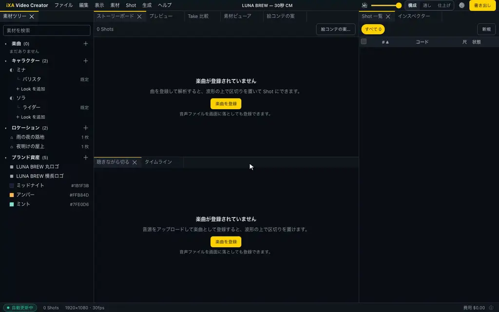
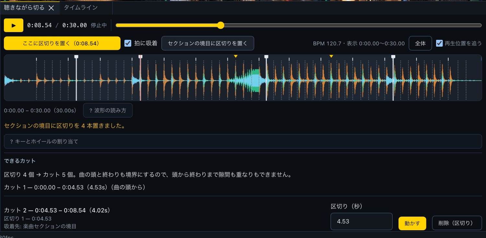
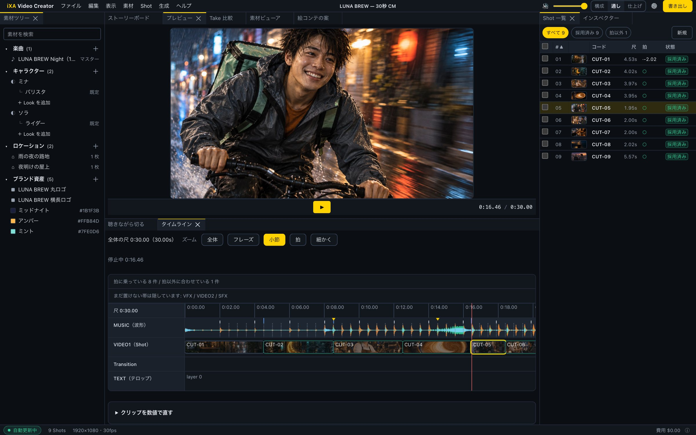
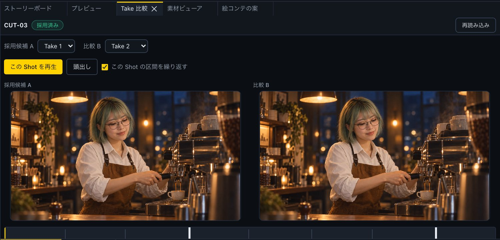
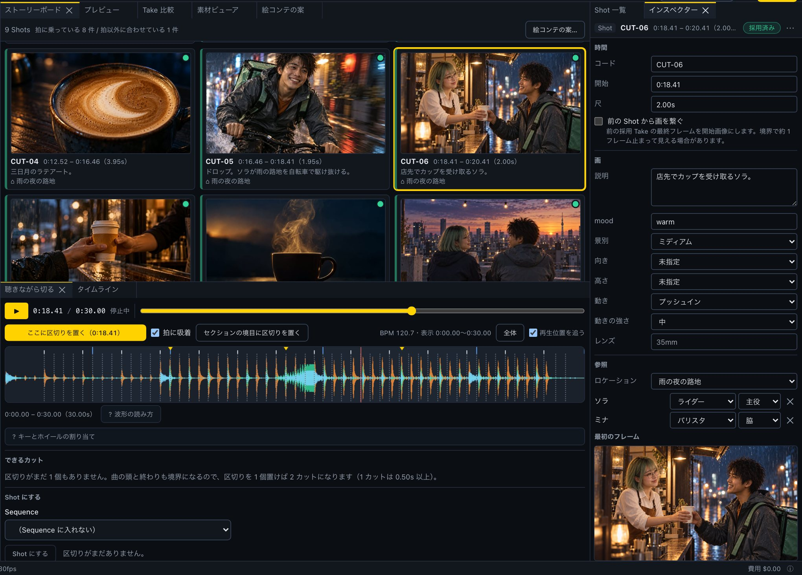
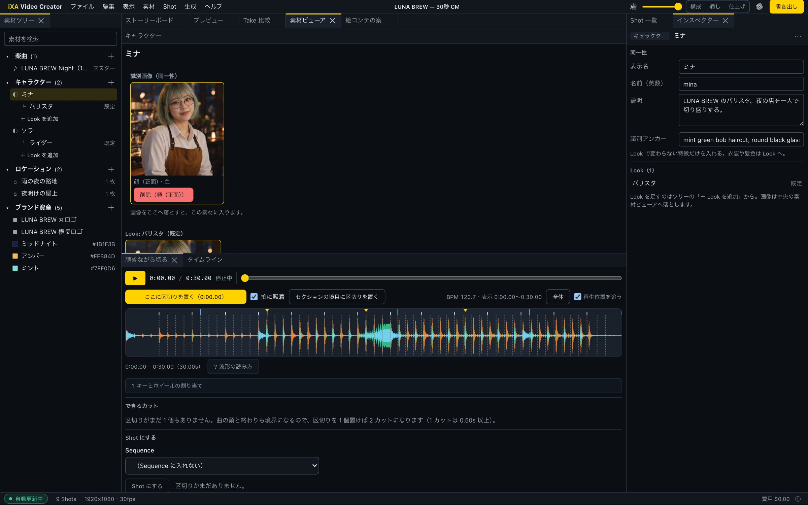
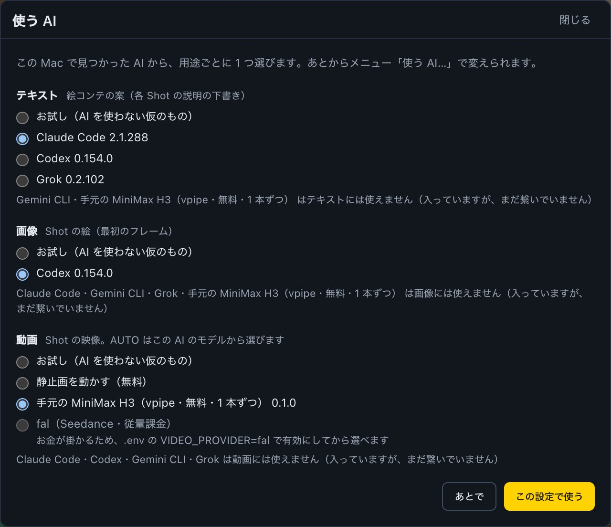

# iXA Video Creator

**Start from the song. Time the lyrics, cut it, let AI draft the storyboard, the frames and the
takes — and render a music video that matches exactly what you previewed.**

[](https://github.com/kabatin/ixa-video-creator/actions/workflows/ci.yml) [](https://github.com/kabatin/ixa-video-creator/releases) [](./LICENSE) [](https://github.com/kabatin/ixa-video-creator/stargazers)

[日本語版 README](./README.ja.md) · MIT licensed · TypeScript monorepo



<sub>Drop a song → cut at its section boundaries → shots → a take for every shot → play it through. Recorded in real time on the LUNA BREW sample; only the waiting for takes is cut.</sub>

---

## Music first

Most AI video tools begin with a text prompt, hand you a clip, and leave you to slide music
underneath afterwards. This one runs the other way round.

**The finished track is the input.** You drop a song onto the window, it is analysed with
librosa — beats, downbeats, drops, three-band RMS — and from that moment the song *is* the
timeline:

- the film's length is the song's length; there is nothing to overrun
- every cut is a position in the waveform, placed while listening to it
- a shot's duration is a consequence of where you cut, not a number typed into a form
- that duration is what gets sent to the video model, so what comes back is the length the
  music asked for
- if the song has lyrics, you tap the start of each line while it plays, and the lines become
  timed captions — checked on a black screen before a single frame is generated

The work is therefore *edit against the music, then fill each slot* — never *generate clips
and hope they fit*. The first film made with it is a 1m56s music video in 27 shots.



## From an empty project to the exported file

A bar under the menu walks you through the whole job and always highlights the next step. Each
step shows ✓ when it is done, or how far along it is.


1. **Song** — drop an audio file; it is analysed for beats, downbeats and sections.
2. **Direction** — concept and synopsis, lyrics, and the look (style, light, texture), plus
   things to avoid and style reference images. They are added to every generation, so you write
   them once. Tick *instrumental* and the lyric steps are skipped.
3. **Lyric timing** — play the song and press Enter on the first syllable of each line.
4. **Captions** — the timed lines become text clips. The preview plays the song with the
   captions over black, so you can check timing without generating — or paying for — any
   pictures.
5. **Cut into shots** — place cuts while listening (Enter works anywhere, cuts snap to the
   beat), or in one click at section boundaries or lyric starts. Cuts are a draft until you
   press *N cuts → shots*.
6. **Storyboard** — an AI drafts a description and a mood for every shot, each with *why this
   picture*. It reads the lyrics sung during that shot, the characters, the locations and the
   look. Nothing changes until you adopt a draft, shot by shot; you can always write your own.
7. **Frames** — an AI draws each shot's start frame from its storyboard, with the cast's
   reference images. Frames are made one at a time, and you can stop the queue at any point.
8. **Takes** — the video for each shot, made from its start frame. While they render you see
   which are queued, which are waiting inside the generator and which are being made, with the
   time elapsed and an estimate; generation can be stopped at any point.
9. **Export** — H.264, the whole film or only the shots you selected. The file is saved into
   `~/Movies/ixa-video-creator/<project>/`, and one button opens that folder in Finder.

Skipping a step is allowed, but you are asked first — for example, before drawing frames for
shots that have no storyboard yet.

## A 30-second spot, start to finish

The sample project is **LUNA BREW**, a fictional night coffee stand: a 30-second spot cut to a
120 BPM track, nine shots, two recurring characters.


These stills were made with an image model outside the app and brought in as each shot's
**start frame** — which still works. Since v0.2 the app can also draw start frames itself. The
built-in `local/still-motion` model turns a start frame into a take — a slow push, pull or pan
that follows the shot's camera setting — for free and without an API key. Switch to another
video model later and the same start frames carry over.

| | |
|---|---|
|  |  |
| **Preview is the render** — the player and the export share one composition. | **Compare takes on the beat** — two takes of a shot, looped over the shot's span. |
|  |  |
| **One shot, everything in one place** — camera, cast with looks, location, start frame. | **Characters, looks, locations, brand** — per project, importable from other projects. |


## Why it might interest you

**The song's structure is data, not a picture of a waveform.** Beats and downbeats are
numbers you can snap to, filter by and sort against. The tool shows where each shot sits
relative to the beat *without calling it a mistake* — cutting to a vocal onset rather than a
beat is a choice, and on the reference project 16 of 27 cuts are deliberately off the grid.

**Preview is the render.** The player and the exported file consume the *same*
`TimelineDocument` through the *same* Remotion composition. There is no separate "preview
path" that can drift from the output — a class of bug that eats hours.

**You choose the AI for each job, from what is already on your machine.** Text (storyboard
drafts and writing help) can be Claude Code, Codex or Grok; images can be Codex; video can be
the free local models or fal. The CLIs run under your own sign-in — no API keys for them are
stored in the app.

**AI drafts never overwrite your work.** Storyboard drafts sit next to the current description
with a reason for each, and a shot changes only when you adopt its draft. Bulk edits are
recorded so they can be undone. Takes are append-only: generating again never replaces a
previous result.

**Built for keeping one character across a whole film.** Characters, looks, locations and
brand assets resolve into each shot's reference images, rather than prompt text you retype 27
times and get subtly wrong. A character sheet (four views) can be made from a single image, and
storyboard drafts are told to describe only the appearance you actually wrote down — the rest
comes from the reference images.

**Providers are swappable, and the swap is free to test.** `VideoProvider` is a
three-method interface (`submit` / `poll` / `cancel`). A local FFmpeg stub implements it
fully, so the entire pipeline — queueing, polling, failure handling, budget limits — runs
end to end at zero cost before you ever connect a paid API.

**Money is treated as a first-class hazard.** Per-project budgets are enforced server-side
before a job is enqueued. The stub can be given a fake price so you can *prove* the budget
guard stops a run without spending anything. Failed generations release the shot instead of
leaving it stuck, and a transient network error never discards work you already paid for.

## How it fits together

```
apps/
  web       Next.js workbench — dockable panels (storyboard, cutter, timeline, compare, drafts)
  api       Hono + zod-openapi
  worker    BullMQ consumers: video and image generation, media probing, rendering
  audio     Python service — librosa analysis (beats, downbeats, sections, waveform)
packages/
  domain    Pure. No IO. The single source of truth for the model.
  providers Adapters (video / image / llm). External SDKs and CLIs stop here.
  render    Remotion composition + FFmpeg plan
  db        Drizzle schema and repositories
```

The dependency direction is always `apps → packages → domain`, never back.

**Shot First.** Storyboard, generation, takes, review and the timeline all hang off one
entity. A `Shot` owns its position on the master timeline — the position you gave it by
cutting the song — so there is no second place where time can disagree. Time is stored in
seconds as a float, because that is the unit the audio analysis speaks; frames and
milliseconds never enter the domain or the database.

## Quick start

Requires Node 22, pnpm 9, Docker, FFmpeg, and [uv](https://docs.astral.sh/uv/) with
Python 3.11+ for the audio service (`uv` installs its Python dependencies on first run).
Optional: [Claude Code](https://docs.anthropic.com/en/docs/claude-code),
[Codex](https://github.com/openai/codex) or Grok CLI, signed in on the same Mac, for AI text and
images.

```bash
git clone https://github.com/kabatin/ixa-video-creator.git
cd ixa-video-creator
pnpm install

cp .env.example .env          # defaults are safe: nothing bills
# signing key for the URLs that show your footage in the browser (required for local files, ADR-0041)
printf 'STORAGE_SIGNING_SECRET=%s\n' "$(openssl rand -hex 32)" >> .env
pnpm infra:up                 # postgres, redis
pnpm db:migrate
pnpm db:seed                  # creates a workspace and writes its id into .env

pnpm dev                      # web :3000, api :3001, worker, audio :8100
```

Open <http://localhost:3000>, create a project, and drop an audio file onto the window — the
flow bar takes it from there. **Out of the box everything runs on local stubs — no API keys,
no cost.**

### Choosing which AI to use



The first time you open the workbench, the *使う AI* (which AI to use) dialog appears. It looks
for the AI CLIs installed on this Mac and a local generation server, and lets you pick one for
each job:

| Purpose | Choices |
|---|---|
| Text — storyboard drafts, ✦ AI writing help, automatic review | Claude Code · Codex · Grok · stub |
| Images — shot start frames, character sheets | Codex · stub |
| Video — takes (AUTO picks among this AI's models) | local still-motion (free) · local MiniMax H3 via vpipe (free) · local Wan 2.2 5B via wan-api (free) · fal (paid) · stub |

Change it later from *iXA Video Creator → 使う AI…*. Until you choose, the `.env` settings apply.
fal and the local server must be enabled in `.env` before they can be chosen — the screen alone
never opens a billing path. Codex image generation uses your plan's usage and takes about a
minute per frame, so frames are made one at a time.

### Connecting a real provider

```bash
# .env
VIDEO_PROVIDER=fal            # default is `stub`
FAL_API_KEY=...
```

Generation now costs real money. The switch is deliberate and separate from the key: simply
having a key present never enables billing. Choosing `fal` without a key stops the worker at
startup rather than silently falling back to the stub.

Settings → *Connections and runtime* shows which keys are set (never their values) and
whether the billing path is open.

### Generating on this Mac (optional)

Two local generation servers can act as free video providers, and **both can be enabled at once**:

| Server | Model | Default address |
|---|---|---|
| [vpipe-api](https://github.com/kabatin/vpipe-api) | MiniMax H3 Turbo | `http://127.0.0.1:8765` |
| [wan-api](https://github.com/kabatin/wan-api) | Wan 2.2 TI2V-5B | `http://127.0.0.1:8766` |

```bash
# .env (comma-separated; default is `none`)
LOCAL_VIDEO_GENERATOR=vpipe,wan
VPIPE_API_URL=http://127.0.0.1:8765
VPIPE_API_TOKEN=              # required only when the URL points off this machine
WAN_API_URL=http://127.0.0.1:8766
WAN_API_TOKEN=                # same
```

Three steps: **start the server, list it in `LOCAL_VIDEO_GENERATOR`, pick it under *Which AI*
for video.** Installing and running the servers is documented in their own READMEs.

Each listed server contributes two models (draft and standard). AUTO chooses among them only
when that server is the selected video AI; otherwise it never picks them.

**They share one GPU, so ixa never runs two local generations at the same time.** Ask for two
and they finish one after another; the waiting one shows as *waiting in line* rather than in
progress.

**Wan tops out at 5 seconds** (wan-api's contract). A 5–7.5s shot is generated at 5s and slowed to
fit; beyond 7.5s ixa asks you to split the shot. Use MiniMax H3 (up to 10.125s) for longer cuts.

Measured on an M5 (10-core GPU, 32 GB), on AC power, 832×480 output, one 5-second clip:

| | H3 (draft) | Wan (draft) | Wan (standard) |
|---|---|---|---|
| time | **7.4 min** | 11.3 min | 19.4 min |
| frame 0 vs start image (SSIM) | 0.695 | **0.851** | 0.852 |

**H3 is faster; Wan holds the start frame.** Which one to use is your call — nothing here scores
how the results look. See [ADR-0031](./docs/adr/0031-local-h3-video-via-vpipe-api.md),
[ADR-0040](./docs/adr/0040-local-wan-2-2-video-via-wan-api.md) and wan-api's
[benchmark.md](https://github.com/kabatin/wan-api/blob/main/docs/benchmark.md).

Note: with wan-api's `drawthings` backend a start image is rejected — use the `mlx` backend
(the default) for image-to-video.

## Costs, honestly

Everything except fal is free to run: the stubs, `local/still-motion` and the local MiniMax H3
and Wan 2.2 servers. Claude Code, Codex and Grok use whatever plan you are already signed in with.

For the reference project — 27 shots, 110.9s of edited footage — Seedance 2.5 via fal.ai
bills **140s**, because the model's minimum clip is 4 seconds and 12 of those shots are
shorter. At $0.3024/s that is **$42 for one take each**, or **$127 for three**.

Short cuts and a 4-second minimum are a bad match. Budget accordingly, and start with one
take.

## Status

Working end to end, from an empty project to an exported file: analysis → direction → lyric
timing → captions → cutting → AI storyboard drafts → AI start frames → takes → review →
timeline → H.264 export. The local video paths (still-motion, MiniMax H3 via vpipe, Wan 2.2 5B via
wan-api) are measured on real hardware — though **no clip has been generated from ixa through
wan-api yet**: those numbers come from wan-api's own benchmarks and the adapter is covered by
contract tests (ADR-0040). The fal.ai / Seedance 2.5 adapter is implemented and tested against
mocked responses, but its capability numbers — price per second, output frame rate — are
**from documentation, not measured**, and are marked as such in the source.

This is a personal project built in the open. Interfaces still move.

## Security

**The API has no authentication.** It binds to `127.0.0.1` by default. Do not expose it to
a network you do not control — see [SECURITY.md](./SECURITY.md).

## Third-party licensing

This project is MIT. Some dependencies carry obligations that pass to **you** as the
operator:

- **[Remotion](https://www.remotion.dev/docs/license)** is free for individuals and
  organisations of up to three people who operate it; **four or more requires a company
  license**, and headcount is aggregated across collaborating parties. MIT on this
  repository does not waive that.
- Provider APIs (fal.ai and others) bill you directly under their own terms.
- Claude Code, Codex and Grok run under your own accounts and their own terms.
- **MiniMax H3** (only if you enable the optional local generator) is released under the
  MiniMax H3 Community License, which restricts where and how the weights may be used.
  ixa does not ship the weights; check the license before enabling it.
- **Wan 2.2** (likewise, only if you enable it) is published under Apache-2.0, which permits
  commercial use. ixa does not ship the weights; the attribution and license-notice
  obligations fall on you as the operator — check the model card.

## Contributing

Issues, [discussions](https://github.com/kabatin/ixa-video-creator/discussions) and pull requests are welcome — see [CONTRIBUTING.md](./CONTRIBUTING.md). Please read [AGENTS.md](./AGENTS.md) first — it
documents the conventions this codebase actually enforces (immutability, zod at every
boundary, no `any`, secrets only via env, append-only takes). `CLAUDE.md` holds the naming
and wording rules, and [docs/LESSONS.md](./docs/LESSONS.md) collects the mistakes this
project actually made and the rules that came out of them — mostly variations on *a green
test suite that was checking nothing*.

Run what CI runs before opening a PR:

```bash
npx turbo run lint typecheck test --concurrency=2
```

If this project is useful or interesting to you, a ⭐ helps other people find it.

## License

[MIT](./LICENSE) © Hiroshi Kabayama
